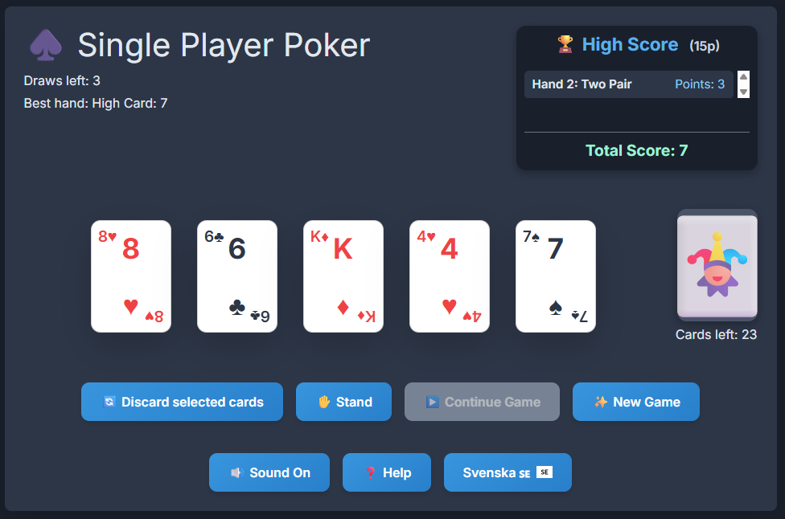

# SinglePlayerPoker

This is a single-player poker game built with HTML, CSS (Tailwind CSS), and JavaScript.

What the Application Does:
Core Gameplay: You start with a five-card hand, can choose to discard and replace cards (limited draws), or "stand" to end the hand.

Hand Evaluation & Scoring: After each hand, your poker hand is evaluated and assigned a numerical score based on standard rankings, with the best result displayed.

Multi-Hand Play & High Score: The game consists of multiple rounds until the deck runs out of cards. A "High Score" list shows the results for each hand during the session, and a "Total Score" accumulates all your points.

Persistence: Your total score is saved in a browser cookie, so it remains even if you reload the page.

Interface & Features: The game features a responsive design that adapts to different screen sizes. It includes card animations, sound effects (which can be toggled on/off), a help section with game instructions, and the ability to switch languages between English and Swedish.

♣️[Play Sinle Player Poker](https://htmlpreview.github.io/?https://github.com/hakimsjo/single-player-poker/blob/master/index.html)

